# inter-session

**Connect the Claude Code sessions you already have open, and let them talk.**

Each session joins a localhost bus and can message any other connected
session. Incoming messages arrive as prompts and are **acted on as
instructions by default**, so one session can drive another. Delivery is
push, not poll — built on Claude Code's `Monitor` tool: millisecond
latency, and zero token or CPU cost while idle.

No claude.ai login. No configuration. Localhost only, Unix only (macOS,
Linux, WSL2).



## Why this exists

Claude Code already spawns **subagents** (a worker inside your session)
and **agent teams** (a fresh team launched for one task). Both create new
workers, run one task, and discard them.

inter-session is the other axis: it links the **long-lived sessions
you've already opened** across terminals and projects. Each keeps its own
project, conversation history, and tool permissions — the bus only routes
messages. That makes the accumulated context the asset:

- **It's already warm.** Hours of conversation, the right files in view,
  permissions granted. Nothing to re-prime.
- **It compounds.** In a back-and-forth loop (implementer ⇄ reviewer,
  red ⇄ blue), each side's context grows more useful every round.
  Subagents reset between calls; agent teams exit when the task ends. A
  pair of inter-session peers can run for hours, then resume tomorrow.
- **It's peer-to-peer.** Any session messages any other, or broadcasts to
  all. No lead, no orchestrator.

|              | Subagent              | Agent team             | inter-session                       |
| :----------- | :-------------------- | :--------------------- | :---------------------------------- |
| Lifecycle    | spawned, then exits   | spawned, then exits    | connects sessions you already have  |
| Context      | fresh worker          | fresh teammates        | your live, accumulated sessions     |
| Topology     | reports to caller     | shared task list       | peer-to-peer + broadcast            |
| Best for     | one focused subtask   | one multi-part task    | long-running, cross-session work    |

Reach for a **subagent** for a quick, focused result; an **agent team**
for one task that needs several coordinated workers; **inter-session**
when you're already running multiple sessions and want them to talk —
delegate a fix from one project to another, run a multi-hour
implementer/reviewer loop, or coordinate without copy-pasting between
terminals.

## Install

The standalone skill gives the shortest command. Its trigger is the
install **directory name**, so symlinking it as `is` makes the command
`/is`:

```bash
git clone https://github.com/1-fares/claude-code-inter-session.git ~/src/claude-code-inter-session
ln -s ~/src/claude-code-inter-session/skills/inter-session ~/.claude/skills/is
```

(The symlink target must be an absolute path. Then run `/is` in any
session — dependencies install themselves on first use.)

<details>
<summary>Install as a plugin instead</summary>

The plugin adds a config UI (port, idle-shutdown) and marketplace
updates, at the cost of a longer, namespaced command
(`/inter-session:inter-session …`):

```
/plugin marketplace add https://github.com/1-fares/claude-code-inter-session
/plugin install inter-session
```

In plugin mode the monitor starts lazily, on first command. Switch to
always-on with `/inter-session:inter-session auto-start on`, then
`/reload-plugins`.

</details>

## Use

```
/is c backend          connect this session as "backend"
/is s web "…"          send a message to the session named "web"
/is l                  list connected sessions
/is d                  disconnect
```

The flow in the demo above: the `backend` session sends a request with
`/is s web "…"`; the `web` session edits, rebuilds, and replies with
`/is s backend "done: …"`. The receiver acts on the message but applies
the same caution as user input — destructive operations need explicit
confirmation, and ambiguous requests get a `question:` clarifier first
(the full [reaction policy](./skills/inter-session/SKILL.md) is enforced
by tests).

<details>
<summary>Example: a multi-hour implementer ⇄ reviewer loop</summary>

`impl` writes a token-bucket rate limiter; `reviewer` next to it writes
adversarial tests. Both stay live throughout — no spawning per round.

```
round 1   impl     → "v1: per-key bucket with refill"
          reviewer → 4 tests, 1 fails: off-by-one at burst threshold
          impl     → "v2: fixed"
round 5   reviewer → "rounds 1–4 still green. new angle: clock skew.
                      leap second causes negative refill"
round 12  reviewer → "all 18 prior cases green. fuzzed 100k combos:
                      deadlock at burst=0. seed saved."
```

By round 12 the reviewer owns a growing suite (`test_burst.py`,
`test_clock_skew.py`, fuzz seeds) that is part of its session state — it
probes new territory instead of re-checking the baseline. A subagent or
fresh teammate would rediscover all of it each round. Both sessions
persist; you can resume the loop the next day.

</details>

Full command set (each subcommand has a short alias):

| Command                            | Short          | Does                                                          |
| :--------------------------------- | :------------- | :----------------------------------------------------------- |
| `/is`                              | —              | Connect (alias for `connect`).                               |
| `/is connect [name]`               | `/is c [name]` | Connect; `name` proposed from context if omitted.            |
| `/is list`                         | `/is l`        | List connected sessions.                                     |
| `/is send <name> <text>`           | `/is s …`      | Send a message to one session.                               |
| `/is send <name> --file <path>`    | —              | Send a file pointer; receiver reads it in full (long content, no cap). |
| `/is broadcast <text>`             | `/is b …`      | Send to all other sessions (≤ 256 KB).                       |
| `/is rename <new-name>`            | `/is r …`      | Rename (disconnect + reconnect).                             |
| `/is status`                       | `/is st`       | Connection state.                                            |
| `/is disconnect`                   | `/is d`        | Stop the monitor.                                            |
| `/is auto-start [on\|off\|status]` | —              | Toggle auto-start (plugin only). Apply with `/reload-plugins`. |
| `/is help`                         | `/is h`        | List subcommands.                                            |

## How it works

Three process classes share one localhost WebSocket bus:

```
   ┌──────────────┐                ┌──────────────┐
   │ CC session A │                │ CC session B │
   └──────┬───────┘                └──────┬───────┘
          │ client.py (Monitor,           │ client.py
          │  long-lived, per session)     │
          └─────────────┐   ┌─────────────┘
                        ▼   ▼
               ┌─────────────────────┐
               │      server.py      │   127.0.0.1:9473
               │  asyncio, single    │   bearer-token auth
               │  instance, idle     │   ~/.claude/data/
               │  shutdown           │   inter-session/
               └─────────────────────┘
                        ▲  send.py / list.py / disconnect.py
                        │  (short-lived control CLIs)
```

- **`server.py`** auto-starts on first connect, via a race-free `bind()`
  election. It owns the agent registry, routes messages, writes
  `messages.log`, and exits after the idle window.
- **`client.py`** runs as a `Monitor` task per session. Each line it
  prints becomes a CC notification — push delivery, no polling.
- **`send.py` / `list.py` / `disconnect.py`** are one-shot helpers run
  over `Bash`.

Deeper invariants — race-free election, role separation, size limits —
are documented in [`CLAUDE.md`](./CLAUDE.md).

## Requirements

- Python ≥ 3.10, Claude Code ≥ 2.1.105.
- Push delivery needs the `Monitor` tool, which is disabled when
  `DISABLE_TELEMETRY` or `CLAUDE_CODE_DISABLE_NONESSENTIAL_TRAFFIC` is set
  (the variable must be **absent**; `0` still counts as set). Without it,
  the client falls back to poll delivery — the receiver wakes on its next
  turn instead of instantly.

## Security

- Server binds `127.0.0.1` only; bearer token at
  `~/.claude/data/inter-session/token` (mode `0600`, dir `0700`).
- Any process running as the same Unix user can read the token and
  connect — acceptable for single-user, single-machine. The token does
  **not** defend against malicious code running as you; if you don't
  trust local code, don't enable inter-session.
- Peer messages are treated as instructions but with user-input caution:
  destructive operations need explicit affirmative content, ambiguous
  ones prompt a `question:` clarifier first.

## Limits

| Limit                     | Value                                              |
| :------------------------ | :------------------------------------------------- |
| WebSocket frame           | 16 MB                                              |
| Direct `text`             | 10 MB                                              |
| Broadcast `text`          | 256 KB                                             |
| Stdout notification body  | 400 chars (CC clips at ~512; the rest goes to `messages.log`, or send a file pointer) |
| Broadcast rate            | 60 / minute / session                              |

Plugin installs can change the `port` (default `9473`) and
`idle_shutdown_minutes` (default `10`, `0` = never) via `/plugin config`.

## Development

```bash
make test         # full suite — auto-bootstraps .venv (uv, or stdlib venv)
make test-fast    # skip subprocess-spawning tests
make clean        # remove .venv
```

TDD throughout. New behavior should come with tests under `tests/`, and
`make test` should pass before opening a PR. Read
[`CLAUDE.md`](./CLAUDE.md) for the non-obvious invariants before changing
the affected code.

## License

MIT, see [LICENSE](./LICENSE).

Forked from
[yilunzhang/claude-code-inter-session](https://github.com/yilunzhang/claude-code-inter-session)
by Yilun Zhang (original author, MIT). This fork adds file-pointer
delivery, the short `/is` invocation, standalone auto-start handling, and
tests.
</content>
